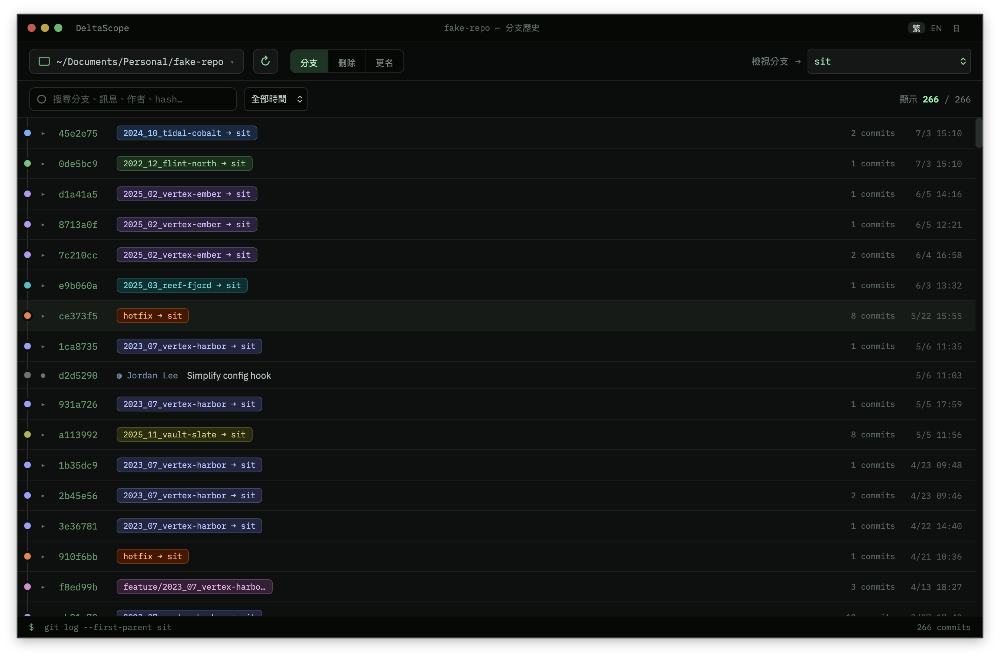
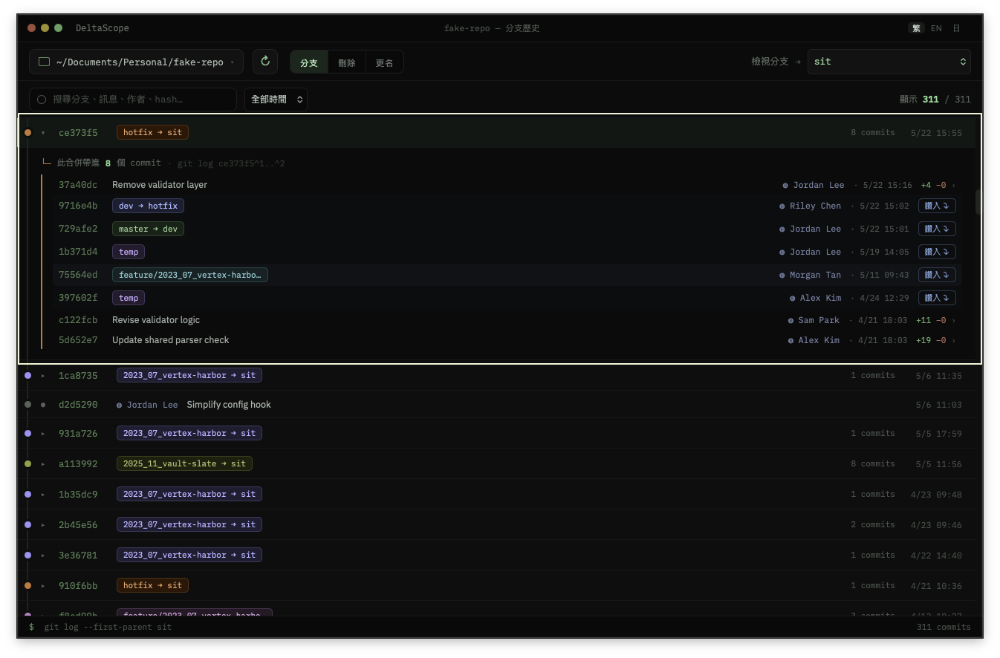
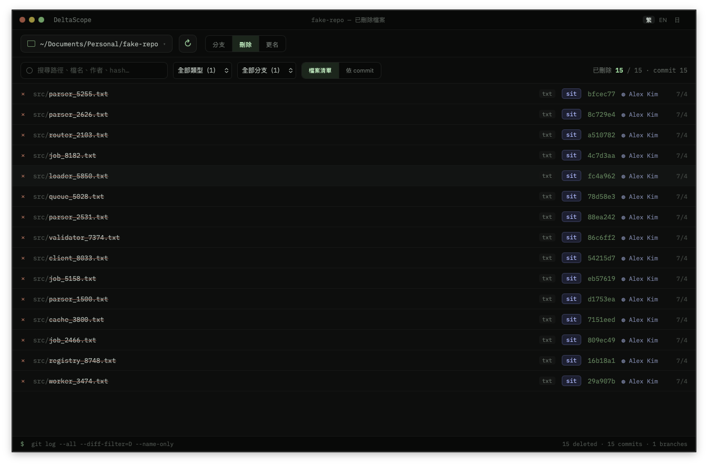
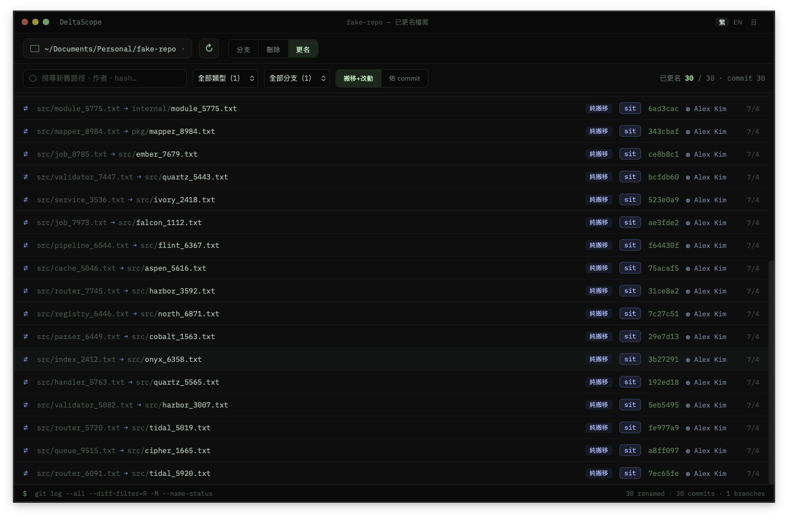

# DeltaScope — visualize a repo's Git history

**English** · [繁體中文](README.zh-TW.md) · [日本語](README.ja.md)

A small Tauri v2 desktop app that reads a local Git repository and turns its
history into a browsable timeline. It answers questions that are awkward on the
command line:

- **What did each merge actually bring in?** — and, when a merge contains
  other merges, drill through them level by level.
- **What files were deleted, and when?** — every removal across all of history,
  with a ready-to-copy restore command.
- **What was renamed or moved?** — pure moves vs. moves that also changed
  content, across all of history.

The UI is a custom-chrome desktop window; the backend shells out to the system
`git` CLI (no libgit2), and every user-facing string is available in
Traditional Chinese, English, and Japanese.

## Stack

- **Frontend:** React 18 + TypeScript (strict) + Vite
- **Backend:** Rust (Tauri v2), shelling out to the system `git` CLI
- **List virtualization:** `@tanstack/react-virtual`
- **Folder picker:** `@tauri-apps/plugin-dialog`

## Run

Requires Node, the Rust toolchain, and `git` on PATH.

```bash
npm install
npm run tauri dev      # dev with hot reload (the real app)
npm run tauri build    # production bundle
```

Launch, click the toolbar path button to pick a Git repository, then use the
**Branch / Remove / Rename** tabs to switch views. The language switcher
(繁 / EN / 日) sits at the right of the titlebar; your choice persists across
restarts and otherwise follows the system language.

## Views

- **Branch** — a branch's first-parent history (`git log --first-parent`).
  Regular commits open a file diff. Merge commits can be:
  - **single-clicked** to expand inline and peek at the commits they brought in
    (`git log <merge>^1..<merge>^2`), or
  - **double-clicked** to open the **merge view** — a dedicated,
    virtualized list of those commits, with a breadcrumb. A contained commit
    that is *itself* a merge drills one level deeper (`main › feature/x › temp`),
    with no depth limit. Opening a merge never lands on an empty diff (git emits
    no patch for a merge commit); it always shows what the merge introduced.

  

  

- **Remove** — every file deleted anywhere in history
  (`git log --all --diff-filter=D`). Each row shows the deleting commit, author,
  and source branch; the detail panel offers a copy-ready restore command and a
  command to view the file's content just before deletion.

  

- **Rename** — every file renamed or moved anywhere in history
  (`git log --all --diff-filter=R -M`). A similarity score separates a pure move
  from a move that also edited content, with commands to track the file's full
  history and to view the rename.

  

Each view filters client-side: by type / branch / date range / free-text search
(path, filename, author, hash, message). Changing the **target branch** in the
Branch view is the only interaction that re-fetches (the `git log` range
changes).

## Layout

```
src/
  App.tsx               titlebar + toolbar + Branch view + shared state / filtering
  DeletedFilesView.tsx  the Remove view
  RenamedFilesView.tsx  the Rename view
  MergeView.tsx         merge-view overlay (fills the window; drill stack + breadcrumb, virtualized)
  ContainedRow.tsx      one contained-commit row (commit → diff, nested merge → drill)
  git.ts                invoke() wrappers + folder picker
  sys.ts                open-with-default-app wrapper
  rows.ts               commit → row mapping, per-branch hue assignment, subject parsing
  data-contract.ts      shared types (must match the Rust serde shapes)
  styles.css            oklch palette, IBM Plex fonts, window/component dimensions
  i18n/
    index.ts            t(), LangProvider, useI18n, detectLang
    locales/            zh-TW (base) · en · ja  — kept isomorphic by the Dict type
src-tauri/
  src/git.rs            default_branch, list_branches, list_branch_commits,
                        count_merge_commits, list_merge_commits, commit_diff,
                        list_deleted_files, list_renamed_files
  src/sys.rs            open_path
  src/lib.rs            Tauri builder + command registration + dialog plugin
```

## License

DeltaScope is licensed under **CC BY-NC-ND 4.0** (Attribution-NonCommercial-
NoDerivatives). You may use and share it free of charge, but you may not sell it
or distribute modified versions. See [LICENSE](LICENSE).
